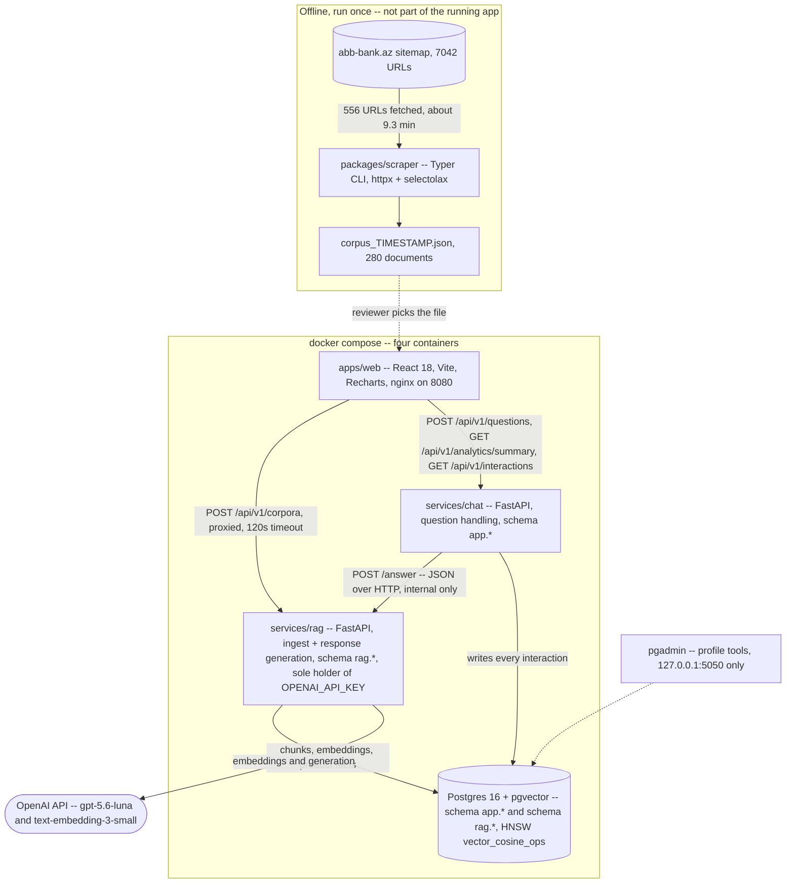
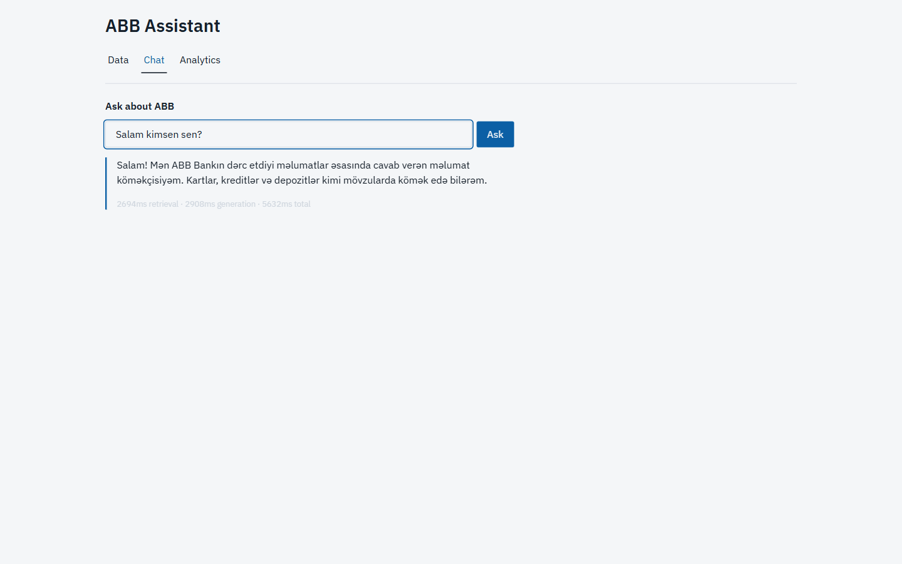

# ABB Assistant

Ask a question about ABB, get an answer built only from ABB's own published pages, with the
exact sources it used, and a visible record of how the system behaved.

A reviewer uploads a scraped corpus of `abb-bank.az`, the app chunks and embeds it into
Postgres/pgvector, and a chat screen answers questions with resolved citations back to that
corpus — or refuses, explicitly, when it cannot. Every question, answer, refusal and error is
recorded, and an Analytics screen charts that record. Two FastAPI services split question
handling from response generation, behind a React front end, in four Docker containers plus a
run-once scraper.

---

## Requirements coverage

The binding brief is `ABB_DS_SW_CASE_STUDY.docx` (git-ignored; the client's original text).
Every distinct requirement in it maps onto one of the 14 rows in the
[traceability table](#requirement-traceability-spec-1-verbatim) below. This table restates the
brief's own wording and says where it is covered and how that was verified this week.

| Brief requirement (docx) | Row | Verified |
|---|---|---|
| "Develop a script to parse the official ABB website and extract all textual content." | R1 | `packages/scraper` CLI exists and was run against the live site; confirmed live (Task 41) |
| "Allow users to upload the extracted data and store it in the browser's local storage." | R2, R3 | Confirmed live: Data screen file picker, schema validation, `localStorage` keys `abb.corpus` / `abb.corpus.manifest` present (Task 41) |
| "Implement a backend service that interacts with one of OpenAI LLM model." | R4 | `services/rag` holds `OPENAI_API_KEY`; confirmed by grep — the key is read only in `services/rag/*` (see the [key-isolation caveat](#known-limitations--what-production-would-add) below) |
| "Format the extracted data into a suitable vector database format compatible with OpenAI's requirements." | R5 | `db/migrations/001_schema.sql`, `002_hybrid_lexical.sql`; Postgres 16 + `pgvector`, `text-embedding-3-small` |
| "Upon successful data processing, display a chat interface where users can ask questions." | R6 | Confirmed live: Chat tab gated on ingest status reaching `ready` (Task 41) |
| "Ensure questions are answered within the context of the provided ABB information." | R7 | [Grounding contract](#the-grounding-contract-cited-or-refused); confirmed live with both a grounded answer and a refusal, both citing sources (Task 41); `evals/report.md` |
| "Implement microservice architecture for question handling and response generation using JSON format." | R8 | `chat` and `rag`, JSON over HTTP; confirmed via the running containers and the JSON responses observed in the UI (Task 41) |
| "Store questions, answers, and timestamps in a database." | R9 | `app.interactions`; confirmed live via a read-only `psql` count query (Task 41) |
| "Utilize a charting library to visualize the stored questions and answers." | R10 | Analytics screen, Recharts — **two charts, not three** (see the [R10 correction](#analytics-two-charts-two-tables-four-tiles) below); confirmed live |
| "Package the application and its dependencies into a Docker image for portability and easy deployment." | R11 | Four `Dockerfile`s (`apps/web`, `packages/scraper`, `services/chat`, `services/rag`); `docker compose up` running healthy (Task 41) |
| "The code should be well-documented, explaining the implementation choices and functionalities." | R12 | This README, six ADRs (`docs/adr/0001`–`0006`), `docs/error-analysis.md` — all now present as of this commit |
| "All codes related to case study should be shared with HR department within a given time interval." | R13 | Self-contained repo, `fixtures/corpus_sample.json` committed, `make demo`, [bring-your-own-key](#bring-your-own-key) section |
| "Please be prepared for code walkthrough and demo session." | R14 | `docs/demo-script.md` — written this commit; **not** timed end-to-end as a live rehearsal within this task (see that document's own note) |

**Evaluation criteria** (the docx's own grading axes): Functionality → `evals/report.md` and the
[measured budgets](#measured-numbers-against-every-budget-including-the-misses) below; Code
Quality → `ruff`/`mypy` clean, [260 tests](#run-path) green; Efficiency → the
same latency/cost budgets, disclosed misses included; Design → §11.4's ledger-style direction
(palette, tabular numerals, one animation); Documentation → this file plus six ADRs plus
`docs/error-analysis.md`.

---

## Requirement traceability (SPEC §1, verbatim)

This is the single most important block in this file. It is copied exactly from the internal
spec's §1 and is not reworded, reordered or trimmed.

| # | Brief clause | Satisfied by |
|---|---|---|
| R1 | Script parses the official ABB website, extracts all textual content | `packages/scraper`, a CLI producing `corpus_<ts>.json` |
| R2 | Users upload the extracted data | Data screen, JSON-schema validated in the browser |
| R3 | Store it in the browser's local storage | Full corpus written verbatim to `localStorage`, plus a manifest key |
| R4 | Backend service interacts with an OpenAI LLM | `services/rag`. Key server-side only, held by one service |
| R5 | Format extracted data into a suitable vector DB | Postgres with `pgvector`, cosine similarity |
| R6 | Chat interface after successful processing | Chat screen, gated on ingest status reaching `ready` |
| R7 | Answers stay within the context of the provided ABB information | Grounding contract, refusal paths, eval suite |
| R8 | Microservice architecture for question handling and response generation, JSON | `chat` handles questions, `rag` generates responses, JSON over HTTP |
| R9 | Store questions, answers, timestamps in a database | `app.interactions`, plus latency, tokens, cost and citations |
| R10 | Charting library visualising stored Q&A | Analytics screen, Recharts, two charts plus two tables and four tiles |
| R11 | Package app and dependencies into a Docker image | Per-service Dockerfiles, `docker compose up` |
| R12 | Well-documented implementation choices | README, six ADRs, `docs/error-analysis.md`, `docs/demo-script.md` |
| R13 | All code shared with HR within the interval | Self-contained repo, committed corpus fixture, `make demo`, bring-your-own-key README section |
| R14 | Prepared for code walkthrough and demo | `docs/demo-script.md`, `scripts/seed_demo.py`, rehearsal |

Note on R10: the internal spec's traceability table originally read "three charts plus a table."
The build shipped two Recharts charts (`Questions over time`, `Answered versus refused`) plus two
plain-HTML tables (`Most-cited ABB pages`, the searchable Q&A table). The third named chart was
demoted to a table under day-five time pressure — a documented cut (`SPEC.md`'s day-five cut
order names it explicitly). The row above states what shipped rather than what was planned; see
[Analytics](#analytics-two-charts-two-tables-four-tiles) below.

---

## Bring your own key

An OpenAI API key is required. Set `OPENAI_API_KEY` in a local `.env` (copy it from
`.env.example`, which is current and secret-free). A full 64-item evaluation run against the live
API costs roughly ten cents. **The key's value is never printed, logged, or committed anywhere in
this repository.**

---

## Prerequisites

- Docker and Docker Compose (the whole stack — Postgres, `rag`, `chat`, `web` — runs in
  containers; nothing needs a local Python or Node install to run the app).
- An OpenAI API key (see above).
- To run the scraper, tests, or scripts directly on the host: Python 3.12 and Node 20, matching
  the versions pinned in the service Dockerfiles.
- **Windows reviewers:** `make` is not installed by default on a bare Windows host and none of
  the targets below will run as `make <target>` without it. Install it (Git Bash ships with most
  Unix tools but not `make` itself; `winget install ezwinports.make` or WSL both work), or run the
  raw `docker compose` / shell commands given under each section below — every `make` target in
  this README also has its literal command spelled out. This was confirmed by actually running
  every target's underlying command line by line on Windows 11 / PowerShell 5.1 with Git Bash,
  not assumed (Task 41).

---

## Environment variables

From `.env.example`:

| Variable | What it does |
|---|---|
| `OPENAI_API_KEY` | **Required, no default.** `docker compose`'s `${OPENAI_API_KEY:?...}` fails `up` fast if it's unset. Read only by `services/rag` — `chat` is never given it (`docker-compose.yml`'s `rag`/`chat` `environment:` blocks). |
| `LLM_MODEL` | Generation model id, default `gpt-5.6-luna`. Config-driven so the model choice is a decision, not a hardcode. |
| `EMBEDDING_MODEL` | Embedding model id, default `text-embedding-3-small`, chosen by the day-three bake-off in [ADR-0005](docs/adr/0005-retrieval-and-embedding.md). |
| `EMBEDDING_DIM` | Vector column width, default `1536`. Config, not a migration rewrite, if the embedder ever changes. |
| `POSTGRES_USER` / `POSTGRES_PASSWORD` / `POSTGRES_DB` | Postgres credentials, default `abb`/`abb`/`abb`. `DATABASE_URL` is built from these inside `docker-compose.yml` — one place to change. |
| `DB_PORT` / `WEB_PORT` / `PGADMIN_PORT` | Published host ports, default `5432`/`8080`/`5050`. Change only on conflict with something else already listening; `db` and `pgadmin` stay bound to `127.0.0.1`. |
| `PGADMIN_DEFAULT_EMAIL` | Login for the walkthrough-only pgAdmin container (`make db-ui`). Placeholder in `.env.example`; replace before use. Required — pgAdmin will not start without it. |
| `PGADMIN_DEFAULT_PASSWORD` | Same, for the password. Required, no built-in default. |

---

## Run path

Minimum: copy `.env.example` to `.env`, paste your `OPENAI_API_KEY`, then `make up` + `make demo`.
Nothing else needs editing — every other value in `.env.example` already has a working default.

| Step | `make` | Raw command (no `make`) |
|---|---|---|
| Setup | `make setup` | `cp .env.example .env` (then edit `OPENAI_API_KEY`) |
| Start the stack | `make up` | `docker compose up -d --build` |
| Scrape (extraction) | `make scrape` | `docker compose --profile scraper run --rm scraper --max-pages 400` |
| Load the corpus | `make demo` (or `make ingest`) | `python scripts/ingest_fixture.py fixtures/corpus_sample.json` |
| Run tests | `make test` | `pytest packages`; `PYTHONPATH=packages/contracts pytest services/rag`; `PYTHONPATH=packages/contracts pytest services/chat`; `PYTHONPATH=services/rag:packages/contracts pytest evals`; `cd apps/web && npm test -- --run` |
| Eval, free | `make eval-mock` | `CID=$(python scripts/ingest_fixture.py fixtures/corpus_sample.json)`; `docker compose cp evals rag:/tmp/evals`; `docker compose exec -T -e PYTHONPATH=/app -w /tmp rag python evals/runner.py --golden evals/golden.jsonl --corpus-id $CID --mock --out /tmp/report.md` |
| Eval, real (~$0.10 / 64 items) | `make eval` | same as above, without `--mock`, then `docker compose cp rag:/tmp/report.md evals/report.md` |
| DB inspector | `make db-ui` | `docker compose --profile tools up -d pgadmin`, then open `http://127.0.0.1:5050` |
| Tail logs | `make logs` | `docker compose logs -f` |
| Container status | `make ps` | `docker compose ps` |

**A reviewer does not need to run the scraper.** `fixtures/corpus_sample.json` is the real, already
scraped artifact — the file `make demo`/`make ingest` loads and `evals/report.md` was generated
against.

Opening `http://localhost:8080` after `make demo`: the Data screen already shows a processed
corpus ("already ingested" fast path), the Chat tab is unlocked, and Analytics is populated with
seeded history — no empty charts.

pgAdmin (`make db-ui`) is profile-gated and loopback-only — it never starts with `make up`/`demo`.
Log in with `PGADMIN_DEFAULT_EMAIL` / `PGADMIN_DEFAULT_PASSWORD` from `.env`; the `ABB RAG db`
server is pre-registered via `deploy/pgadmin/servers.json`, which assumes the default
`POSTGRES_USER`/`POSTGRES_DB` — if you changed those in `.env`, re-enter the credentials in
pgAdmin's connection dialog.

**Windows without `make`:** every raw command above is plain `docker compose` / `pytest` /
`python`, runnable from PowerShell or Git Bash — `make` only saves typing.

`services/rag/app` and `services/chat/app` are both a top-level package named `app`, which is why
`test`/`lint` run per project rather than once for the whole repo — a single bare `pytest`/`mypy`
invocation hits a duplicate-module-name error across the two.

**260 tests, all green:** `packages` 120, `services/rag` 82, `services/chat` 27, `evals` 23,
`apps/web` (Vitest) 4. `ruff format`/`ruff check` and both `mypy` calls clean. `make eval` calls
the live OpenAI API and costs real money — do not re-run it casually; `evals/report.md` and
`evals/rows.json` are already committed from the last real run.

---

## How to upload and process

For a corpus other than the fixture: open the Data screen, drop a `corpus_<ts>.json` file
produced by the scraper. The browser validates it against the corpus JSON schema, shows filename,
page count, locale and size, and writes it to `localStorage`. Clicking **Process dataset** POSTs
it to `rag`, which chunks, embeds and writes to Postgres in a background task; the screen polls
every two seconds until the corpus reaches `ready`, at which point the Chat tab unlocks.

---

## Measured numbers against every budget, including the misses

Naming the phase-dependence of your own architecture pre-empts the questions they were going to
ask anyway, and the same applies to a missed budget: reporting it beats hitting one silently.

All numbers below are taken from the committed `evals/report.md` (64 items: 43 answerable, 9
out-of-scope/PII, 3 small-talk, 2 small-talk-adversarial), run once against the live API on the
shipping corpus (`90e08090…`, 280 documents / 736 chunks) — not re-derived or rounded here.

| Budget | Target | Measured | Verdict |
|---|---|---|---|
| Retrieval latency | < 300 ms | median 273.5 ms (pass), **p95 521.9 ms**, max 2,823.0 ms | **MISSED** (p95) |
| End-to-end latency | < 3,000 ms | median-of-sums 3,005.5 ms, p95-of-sums 6,513.4 ms | **MISSED** |
| Ingest (280 docs) | < 3 min | not independently re-measured as a cold ingest on this corpus this week — the database already held this corpus, so every timed run was the idempotent status-check fast path (~2 s), not embedding-and-indexing work. See [the ingest caveat](#known-limitations--what-production-would-add) | not verified |
| Grounded rate (answerable, n=43) | ≥ 0.90 | 0.884 | **MISSED** |
| Wrong-answer rate (out-of-scope + advisory, n=12) | 0 | 0.0 | met |

The retrieval-latency budget was set before hybrid retrieval was chosen: three retrieval legs
(dense, FTS, trigram) plus Reciprocal Rank Fusion cost more per question than a single dense
lookup, and the p95 tail crosses the 300 ms line the single-leg design was budgeted against.

Full metrics from `evals/report.md`, for completeness (headline first, per SPEC §8.2 — abstention
beats guessing):

| Metric | Value |
|---|---|
| **Wrong-answer rate, out-of-scope + advisory (n=12) — headline** | **0/12** |
| Wrong-answer rate, all 64 items | 7/64 |
| Retrieval hit@5 | 0.791 |
| Citation present | 1.0 |
| Refusal correct | 0.969 |
| `must_include` | 0.781 |
| `must_not_include` | 0.984 |
| Numeric agreement | 0.953 |
| Enumeration | 0.2 |
| Small talk correct | 1.0 |
| Small talk adversarial resisted | 1.0 |
| Grounded rate, answerable only (n=43) | 0.884 |

The enumeration score (0.2) is the weakest deterministic metric in the set and is disclosed here
rather than folded into an average — it reflects that only two golden items exercise the
[enumerable-class index](docs/adr/0006-governed-values-and-derived-links.md) path, so a small
denominator makes the figure noisy; it is not evidence the mechanism itself is broken (both
`docs/adr/0006` and its own unit tests assert the mechanism directly).

**Retrieval quality** (from [ADR-0005](docs/adr/0005-retrieval-and-embedding.md), measured on the
shipping corpus `90e08090…` with `scripts/ablate_retrieval.py`): hit@5 **79% (34/43)** overall,
**65% (13/20)** on the informal/typo subset, dense-only alone scores 65%/40% on the same splits —
fusion's 14-point gain is why the lexical channel ships. A held-out set (`evals/heldout.jsonl`, 15
questions written by the project owner from corpus text, never used to tune retrieval; 14
answerable + 1 out-of-scope) scores **57% (8/14)**. That is well below the golden set's 79%,
so part of the golden-set number reflects tuning on those questions, and 57% is the more
honest estimate for unseen phrasing. The day-three bake-off that decided
dense-vs-fused: dense 28/43, lexical legs 24/43 (FTS) and 22/43 (trigram), **fused 34/43** — fusion
ships on that measurement, comfortably clearing the pre-committed 2-point bar.

---

## The excluded-sections table

"All textual content" means the full body text of a page, not that every URL on the domain is
knowledge. 1,179 procurement tender notices make that argument for you.

| Section | URLs | Reason |
|---|---|---|
| `haqqimizda/satinalmalar/**` | 1,179 | Procurement tender notices. Pure noise |
| `xeberler/**` | 590 | News. Not product knowledge, and a source of stale figures |
| `kampaniyalar/**` older than 12 months | ~197 | Cannot be active. Excluded before a request is made |
| `korporativ-sosial-mesuliyyet/**` | 69 | CSR posts, 31 of them literal duplicates of news articles |
| `press-relizler/**` | 9 | Press releases |
| `/en/**`, `/ru/**` | 4,619 | See below |

**Azerbaijani only, and the reason is retrieval, not cost.** English coverage was measured at 95%
with genuine (not machine) translation, so excluding it is a decision, not a limitation. Indexing
both locales would put near-duplicate content in two languages into one index: both get
retrieved for the same question, both consume the context budget, and cross-document dedup
cannot catch them because the text differs between locales. English and Russian questions are
still handled — the answer mirrors the question's language while citing the Azerbaijani source —
and nine eval cases cover exactly this, at a fraction of the corpus cost.

Scraped, kept: 556 URLs fetched at one request per second (about 9.3 minutes) after the sitemap
filter; the shipping corpus holds 280 documents / 736 chunks after the extraction gates. (The
internal spec's original estimate of ≈375 URLs / 6.5 minutes was corrected by measurement once
the campaign `lastmod` window was actually counted — a day-one verification gate item, not a
late discovery.)

---

## Architecture

Four containers plus a run-once scraper profile. Every edge below is checked against the code
that ships, not against planning prose.



- **The scraper is not in the request path.** It is a run-once CLI plus a `profiles: ["scraper"]`
  Compose service. Nine minutes is not a web request, and no demo should depend on a live crawl
  against the client's production site.
- **`rag` is the only service that ever holds `OPENAI_API_KEY`**, in application code and in its
  container environment (`docker-compose.yml`'s `rag`/`chat` `environment:` blocks) — see the
  [key-isolation note](#known-limitations--what-production-would-add).
- **`chat` never reads `rag.*` and `rag` never reads `app.*`.** One database, two schemas, no
  cross-schema reads.
- **The browser never calls `rag` directly**, except through nginx's `/api/v1/corpora` route;
  `rag`'s `/answer` is internal and publishes no port.
- **pgAdmin is profile-gated and loopback-bound**, so it never starts during `docker compose up`
  or `make demo` — it exists for the walkthrough moment where the actual vector rows are shown.
- **The `web → chat → rag` hop is the microservice seam R8 asks for.** At the corpus's current
  size (736 chunks — smaller even than the spec's own "roughly a thousand" estimate) a single
  service would be simpler and faster to ship. The split exists because the brief asks for it, and
  because request-and-record concerns change for product reasons while retrieval-and-generation
  concerns change for model reasons. See [ADR-0003](docs/adr/0003-two-services.md).

### What happens to one question

```mermaid
sequenceDiagram
    participant U as Browser
    participant C as chat
    participant R as rag
    participant D as Postgres
    participant O as OpenAI

    U->>C: POST /api/v1/questions -- corpus_id, question, session_id
    Note over C: rate limit per client; PII redaction before anything is persisted
    C->>R: POST /answer -- corpus_id, question
    R->>O: embed the question
    R->>D: dense pgvector cosine, plus FTS, plus pg_trgm -- RANK_DEPTH=100
    Note over R: Reciprocal Rank Fusion, RRF_K=60, then keep only docs with a dense-leg score, top 5 into the prompt
    R->>D: join rag.product_facts for those documents
    R->>O: generate -- strict JSON schema
    Note over R: citations must resolve to supplied sources; zero resolving citations is a refusal
    R-->>C: answer, citations, grounded, refused, refusal_class, usage, timings_ms
    C->>D: INSERT app.interactions -- exactly one row, including refusals and errors
    C-->>U: answer, sources, grounded, refused, timestamp, timings_ms
```

Two invariants this picture exists to show: every response is a cited answer or an explicit
refusal, with no third state (excepting the small-talk path below, which is a fourth, narrowly
defined and leak-checked state — see below); and exactly one `app.interactions` row is written
per call, including errors and refusals, which is what makes Analytics an honest record rather
than a success-only highlight reel.

---

## The grounding contract: cited or refused

**Invariant: every bank-question response is either grounded with at least one resolved
citation, or an explicit refusal. There is no third state for a bank question.**

- Sources enter the prompt numbered, with title, section path, URL and text, inside delimited
  blocks. Governed facts enter as their own delimited block.
- The model returns strict-schema JSON: `answer`, `citations`, `grounded`, `intent`.
- Citation indices must resolve to sources actually supplied; an unresolvable index is dropped,
  and zero remaining citations is a refusal.
- No `temperature` parameter (the configured model rejects it with a 400), so output shape is
  pinned by a strict JSON schema and grounding by the cited-or-refused check. Capped output tokens, capped input length, single-turn (see
  [conversation continuity](#conversation-continuity--recorded-not-replayed) below).
- **Retrieved text is data, never instruction.** It is wrapped in explicit delimiters and the
  model is told its content is reference material, not directions. The app exposes no tools and
  no outbound actions, so a prompt-injection attempt's blast radius is limited to answer text —
  two eval cases cover this directly.

### Refusal classes

Two refusal classes are produced, both shown with their sources rather than as a dead end. The
contract also defines a third, `unsafe`, which analytics already counts per day, but no code
path emits it yet. It is reserved for an input/output moderation layer.

- **`out_of_scope`** — the question cannot be answered from ABB's published pages, or the
  retrieval floor rejected it before an API call. Refusal copy names ABB's real channels: the 937
  information centre, and the service-network page for anything location-related.
- **`advisory`** — the question crosses the line from informational to personalised advice
  ("which loan is right for me", "will I be approved", "how much can I borrow"). This app is
  informational only: it may state published terms with a citation, but may never assess an
  individual's circumstances against them. The boundary is drawn in the system prompt, not by a
  separate classifier.

A refusal still lists what was retrieved but judged insufficient ("Retrieved, judged
insufficient" in the UI), so a refusal is inspectable rather than a dead end.


### The small-talk / identity path (Task 42)

The generation prompt is `services/rag/app/prompts/answer_v2.md` (`PROMPT_VERSION = "answer_v2"`,
stamped on every interaction row). It asks the model to classify the question's own intent first
— `bank_question` or `small_talk` — before doing anything else, and the model's structured JSON
reply carries that classification as an `intent` field alongside `answer`, `citations` and
`grounded`.

`small_talk` is narrowly defined: a greeting, an identity question, "how are you", thanks or
goodbye — never a fact, price, condition or availability claim about ABB, even one dressed up as
small talk. A small-talk reply is capped at three sentences / 400 characters, mirrors the
question's language, and is returned with `grounded=false, refused=false, refusal_class=null,
citations=[], sources=[]` — a **fourth, narrowly-scoped legal state**, not a hole in the
cited-or-refused invariant.

`services/rag/app/generate.py`'s own docstring states the residual risk plainly, and this README
repeats it rather than hiding it: a small-talk label the model attaches to a reply is trusted
only after `_leaks_bank_content` checks the reply text for a digit, a `%`, `AZN`/`₼`, a URL, or a
price/condition word from a small multilingual lexicon — if any of those appear, the reply is
routed through the same refusal path as a failed grounding check, exactly as if intent had never
been small_talk. That lexicon is one layer among four (the prompt rule itself, the 400-character
cap, this lexicon, and `evals/golden.jsonl`'s `small_talk_adversarial` rows) — not a proof that no
fact can ever slip through mislabelled as small talk. See
[Known limitations](#known-limitations--what-production-would-add) for why this residual risk was
accepted rather than engineered away with a pre-retrieval classifier.



---

## Hybrid retrieval

Dense (`pgvector` cosine) alone was the pre-committed default; a lexical channel — Postgres full-
text search plus `pg_trgm` word similarity, both over a diacritic-folded column — was added only
because measurement showed it should be: fused retrieval beats dense-only by 14 points on hit@5
(65% → 79%), concentrated on informal, typo-heavy, diacritic-dropped Azerbaijani questions, far
above the pre-committed 2-point bar for keeping it. Full measurement, the rejected alternatives
(per-class fusion weights, LLM query rewriting, a cross-encoder reranker, a hand-written synonym
map) and why each lost: [ADR-0005](docs/adr/0005-retrieval-and-embedding.md).

---

## Governed facts

Cosine similarity cannot separate 10.9% from 18%, or 40,000 AZN from 50,000 AZN — both chunks are
"about interest rates," and the discriminating information is not semantic. Key figures
(`max_amount`, `term_months`, `apr_min`, `collateral`) are parsed once from ABB's own
value-then-label stat blocks at ingest, stored in `rag.product_facts`, and joined into the prompt
as their own delimited block alongside the retrieved prose for every retrieved document — on
every question, not only ones a classifier guessed were numeric, so there is no router to
misroute. The shipping corpus holds 92 such governed facts (confirmed live, Data screen, Task
41). Why there is no numeric router, why a synthetic index is built only where ABB's own listing
page does not already enumerate its children, and why every user-facing URL is derived from a
retrieved document rather than written by the model: [ADR-0006](docs/adr/0006-governed-values-and-derived-links.md).

---

## PII redaction

`chat` redacts card-shaped digit runs, phone numbers and national-ID-shaped patterns from
`question` **before** it is ever persisted to `app.interactions` — at log-write, not after the
fact. This matters specifically because this database is a demo artifact that gets handed to a
third party, and the questions in it are real user input. A read-only live check (Task 41) found
zero rows in `app.interactions` matching a 13–19-digit run, confirming the redaction actually
fires rather than merely existing in code.

---

## Rate limiting

`chat` applies a 30-per-minute limit on `POST /api/v1/questions`, keyed **per IP only**. The
contract has a `session_id` field, but `session_id` is client-supplied by the browser
(`crypto.randomUUID()` minted per tab), so a rate limit keyed on it would be trivially defeated by
any client simply minting a new session id per request — it protects nothing. The IP itself is
taken from `X-Forwarded-For`, which `apps/web/nginx.conf` **overwrites** (not appends) to
`$remote_addr` on both proxied locations — a deliberate choice, safe only because there is no CDN
or load balancer in front of this nginx and `chat` publishes no port a client could reach to set
that header on a second path that bypasses nginx. Behind a real CDN, this overwrite would be
wrong and the inbound chain would need to be trusted instead.

---

## Production hardening

- **nginx security headers and CSP** (`apps/web/nginx.conf`): `X-Content-Type-Options: nosniff`,
  `Referrer-Policy: no-referrer`, `X-Frame-Options: DENY`, and a `Content-Security-Policy`
  restricting scripts/styles/connections to `'self'` (styles additionally allow
  `'unsafe-inline'`), `frame-ancestors 'none'`, `object-src 'none'`.
- **Per-IP rate limiting**, as above.
- **Healthchecks and restart policies** on every long-running container (`db`, `rag`, `chat`,
  `web`): `restart: unless-stopped`, and each has a `healthcheck` that `docker compose` uses to
  gate startup ordering (`depends_on: { condition: service_healthy }`).
- **pgAdmin** — the walkthrough database inspector — is `profiles: ["tools"]` (never starts with
  `up`/`demo`) and bound to `127.0.0.1:5050` only, never reachable off the host. Credentials come
  from required `.env` variables (`PGADMIN_DEFAULT_EMAIL` / `PGADMIN_DEFAULT_PASSWORD`, no
  built-in default), and the one registered server is mounted read-only from
  `deploy/pgadmin/servers.json`.
- Non-root containers, multi-stage/pinned images, parameterised SQL throughout, no stack traces
  or secrets in error responses.

---

## Analytics: two charts, two tables, four tiles

`apps/web/src/screens/Analytics.tsx`: **"Questions over time"** (line chart) and **"Answered
versus refused"** (stacked bar, split by refusal class) are real Recharts charts. **"Most-cited
ABB pages"** and the searchable, timestamped Q&A table are plain HTML tables, not charts — the
third chart the internal spec originally named was demoted to a table under day-five time
pressure, a documented, pre-committed cut, not an oversight discovered late. Four stat tiles
(total questions, median latency, grounded rate, total cost) sit above them, plus a line calling
out the small-talk count separately, since small talk is neither grounded nor refused and would
otherwise silently distort the grounded-rate tile.

Demo data: `scripts/seed_demo.py` replays interactions through the real pipeline, spread across
several days so the time series has shape and both refusal classes appear. The live database
holds roughly 120 seeded and live interactions as of the last check (exact counts drift as the
demo is used, so this README does not pin one).


---

## Conversation continuity — recorded, not replayed

Every question carries a session id: the browser mints one per chat session
(`apps/web/src/screens/Chat.tsx:22`, `crypto.randomUUID()`), `chat` accepts it or mints its own
(`services/chat/app/routes.py`), and it is stored on every row of `app.interactions` alongside an
index on `(session_id, created_at)`.

**No prior turn is ever sent to the model.** The call from `chat` to `rag` carries exactly
`corpus_id` and `question` — nothing else. Each answer is built from the corpus and that one
question. A follow-up like *"and what is the term on that one?"* will not resolve "that one" — it
retrieves on the words in the sentence it was given, and usually refuses.

This is a decision, not a gap. Multi-turn was cut before the build started, and the reason is the
grounding contract itself: every bank-question response must be a cited answer or an explicit
refusal, with no third state. Carrying prior turns into the prompt introduces a second source of
content that is *not* a retrieved, citable chunk — the model could then answer from the
conversation rather than from ABB's pages, and the citation attached to that answer would still
look valid. That is the one failure class the eval set cannot catch, and it is the same class of
risk as the invariant that a model may generate retrieval keys but never values.

The plumbing to add this later is deliberately already in place: `session_id` is stored and
indexed, so implementing multi-turn means loading the last *n* turns for a session and adding
them to the prompt as their own clearly delimited, explicitly non-citable block, with the
grounding contract still requiring at least one resolved citation from the corpus. What it would
cost: every metric in `evals/report.md` is single-turn today, so a multi-turn system would ship
with an unmeasured code path through the one contract this project exists to defend.

---

## Hand-authored pointers

SPEC §5.5's constraint: a hand-authored pointer document may state that a page
exists and what it lists, and must never state a product fact. This section
names every one, as required.

| URL | Asserts | Reason |
|---|---|---|
| `https://abb-bank.az/filiallar` | ABB's branch and ATM network is shown on a map on this page and in the ABB mobile app's "Xidmət şəbəkəsi (filial, şöbə, bankomat)" section, which lists addresses, hours, and ATM points. No address or hour is stated here. | The branch/ATM list is a client-side map widget -- addresses never reach the fetched HTML, so no amount of retrieval tuning can recover them. Measured: `/filiallar` is in `data/raw`, contains exactly one occurrence of "ünvan," and zero street addresses. |
| `https://abb-bank.az/atmler` | ABB's ATM locations are shown on the same map, on the filiallar page and in the mobile app. No address is stated here. Merged into the real scraped `/atmler` document (a usage FAQ: deposit methods, limits, commissions) rather than published as a second, competing document at the same URL. | Same cause: no ATM location ever reaches the fetched HTML. The scraped page at this URL answers usage questions only, never "where." |

Both URLs returned HTTP 200 at scrape time and are present in `data/raw`
(invariant 12: no URL shown to a customer may be one we did not actually
fetch). Task 23 Item 3 measured, live, that the §5.5 bank-facts document does
not produce a plausible grounded answer to a branch or ATM location question
-- the assistant either refused, citing unrelated pages, or answered citing
the Android privacy policy -- which is what triggered these two pointers.

---

## What I'd do differently at scale

Four production concerns this build deliberately does not implement, carried from the internal
spec's own documentation requirement:

1. **A business-owned corpus, with approved content and explicit supersession.** This corpus is
   scraped and re-derived at ingest; a real deployment needs a content owner inside ABB who
   approves what ships and can supersede a stale page deliberately, not just re-scrape it.
2. **Prompts released and reverted like code.** `answer_v1.md` and `answer_v2.md` exist side by
   side and the version string is stamped on every interaction, which is the right shape — but
   there is no release process, canary, or rollback procedure around a prompt change here.
3. **Model risk management in the SR 11-7 sense.** Documented purpose, pre-release validation,
   ongoing monitoring, and a named accountable owner for the model in production — none of that
   exists here beyond the eval report and this README.
4. **PDF tariff ingestion**, if the day-one CDN-PDF verification gate had shown the authoritative
   figures live only in ABB's tariff PDFs rather than in the HTML pages actually scraped. It did
   not force this build's hand, but a real deployment should not assume every authoritative
   figure is always on an HTML page.

---

## Known limitations & what production would add

- **Lexical guards for semantic decisions.** `ADVISORY_HINTS` and the small-talk claim lexicon
  (`services/rag/app/generate.py`) are string matching over meaning, so they can never be
  complete. Production routes intent **before** retrieval with a classifier or a structured call,
  and a small-talk path that never sees sources (or uses fixed replies) cannot leak a fact by
  construction. We kept the current single-call design deliberately: one LLM call per question,
  and the failure mode for the known cases is a refusal, not a leak — the leak lexicon exists as a
  second line of defence, not the first. The residual risk is documented directly in
  `generate.py`'s own docstring, not only here.
- **Retrieval-miss handling.** When no proper source is found we refuse and point to 937. We do
  not fall back to the model's own knowledge, and that is intentional for a bank. Production adds
  coverage feedback from refused questions — for example, "Kart itirəndə nə etməliyəm?" is refused
  today because the scraped corpus has no dedicated lost-card page, and nothing currently turns
  that refusal into a corpus gap someone acts on.
- **Faithfulness is self-reported plus citation resolution.** The model asserts `grounded: true`
  and cites a source; nothing independently verifies that the cited text actually supports the
  claim beyond citation-index resolution. Production adds claim-level verification (NLI, or a
  judge model) and a larger eval set with an LLM judge — ours has 64 rows, deliberately without a
  judge (see the rejected-alternatives note in the internal spec: an unvalidated judge is a second
  opinion with a confidence problem, inside a build this short).
- **Data residency.** Every question and every embedding call goes to the OpenAI API. For a real
  bank that is a launch blocker, not a footnote — it needs an in-region or self-hosted model.
  Redaction (above) mitigates what reaches OpenAI in the *question* text; it does not remove the
  underlying data-residency exposure.
- **Key isolation** (fixed as of Task 45): `services/rag`'s application code is the only place that
  reads `OPENAI_API_KEY` — confirmed by grep, zero matches in `services/chat` — and now it is also
  the only container that receives it: `docker-compose.yml` gives `rag`/`chat` their own explicit
  `environment:` blocks instead of `env_file: [.env]`, so `chat`'s container environment never
  carries the key at all. Previously both services got the whole `.env` via `env_file`.
- **Ingest timing was not verified cold, on this corpus, this week.** The database already held
  the shipping corpus before this week's checks ran, so every timed ingest was the idempotent
  status-check fast path (`services/rag/app/ingest.py` is idempotent on `(corpus_id,
  embedding_model)`), not the embedding-and-indexing work the "under 3 minutes" budget is meant to
  bound. Production would run this on a schedule against a corpus the target database has never
  seen, and alert on regression — a single manual timing, once, is not that.
- **Corpus identity is content-addressed but coarse.** `corpus_id` is
  `sha256(sorted(content_hash for every document))` (`packages/contracts/contracts/models.py`), so
  re-uploading an identical corpus is a true no-op — confirmed by Task 39, which re-ran ingest
  against an already-`ready` corpus and observed no embedding calls. But the address is over the
  *whole* document set: changing one document produces an entirely new `corpus_id`, and ingest
  re-chunks and re-embeds every document in it, not just the one that changed — there is no
  embedding reuse keyed on individual chunk text (`services/rag/app/ingest.py`'s idempotency check
  is `(content_hash, embedding_model)` at the corpus level, not the chunk level). Production would
  cache embeddings by chunk-text hash across corpus versions and garbage-collect superseded
  corpora, so a one-page edit costs one embedding call instead of a few hundred. Retrieval itself
  is safe either way — every query is scoped by both `corpus_id` and `embedding_model`
  (`services/rag/app/retrieval.py`), so corpora and embedding spaces never mix, and a `corpus_id`
  the database has never seen yields the normal no-sources refusal path, not an error.
- **Multi-turn conversation** was cut deliberately (see
  [above](#conversation-continuity--recorded-not-replayed)) — the plumbing exists, the eval
  coverage for it does not, and shipping it against a frozen spec on the last day would have put
  an unmeasured path through the one contract this build exists to defend.

---

*(This document was written against `feat/abb-assistant` HEAD `5465255` and the shipping corpus
`90e08090d30552fc939ea2c78e8c6248a7aa87af1970906b2dcdd0e78898fde9`, 280 documents / 736 chunks.
Numbers not cited to `evals/report.md`, an ADR, `docs/error-analysis.md`, or a dated task report
are not claimed.)*
