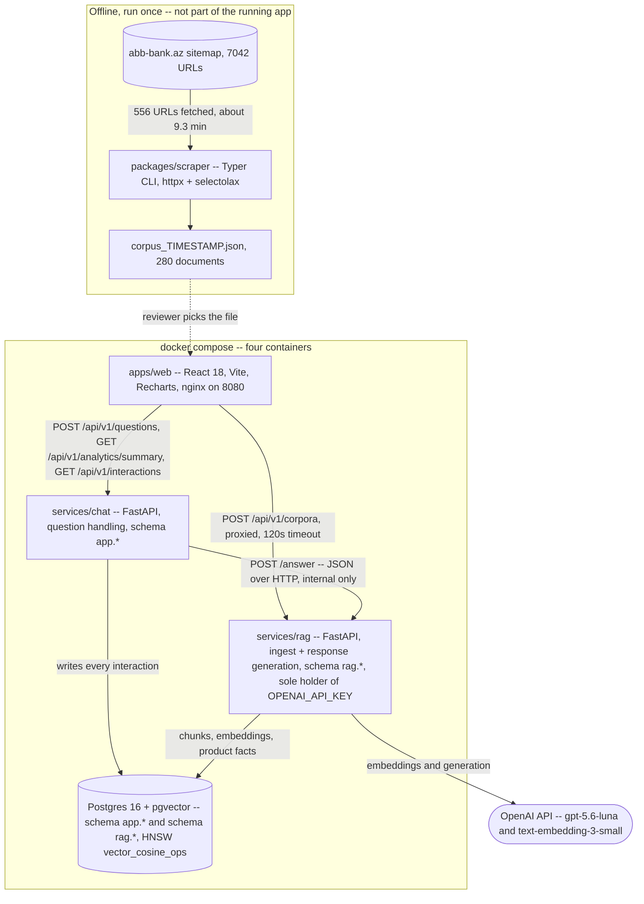
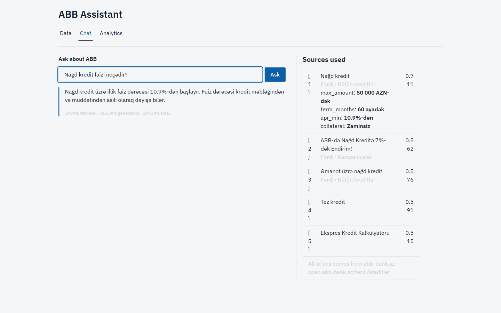
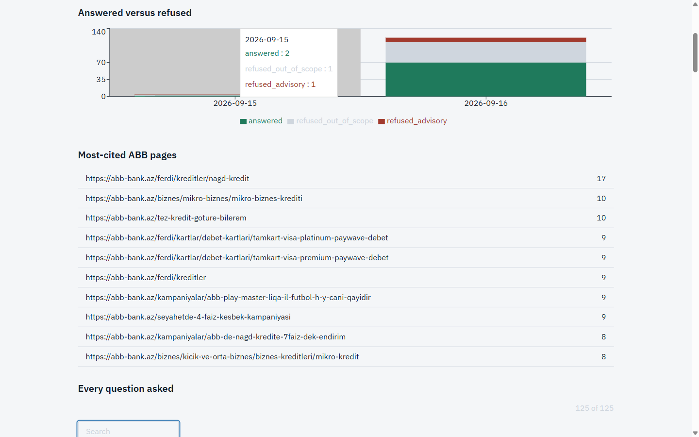

# ABB Assistant

Ask a question about ABB, get an answer built only from ABB's own published pages, with the
exact sources it used, and a visible record of how the system behaved.

A reviewer uploads a scraped corpus of `abb-bank.az`, the app chunks and embeds it into
Postgres/pgvector, and a chat screen answers questions with resolved citations back to that
corpus — or refuses, explicitly, when it cannot. Every question, answer, refusal and error is
recorded, and an Analytics screen charts that record. Two FastAPI services split question
handling from response generation, behind a React front end, in four Docker containers plus a
run-once scraper.

---

## Setup

- An OpenAI API key is required (`OPENAI_API_KEY`) — copy `.env.example` to `.env` and paste it
  in. A full 64-item eval run against the live API costs about ten cents; the key's value is
  never printed, logged, or committed anywhere in this repository.
- Docker and Docker Compose run the four services (`db`, `rag`, `chat`, `web`) plus a run-once
  `scraper` profile.
- For `make demo`/`eval` and the tests outside Docker: Python 3.12 (`pip install httpx` is enough
  to load the corpus) and Node 20 for the web tests.
- **Windows:** `make` isn't installed by default (`winget install ezwinports.make` or WSL); every
  target in the table below also has its raw command.
- Every other setting (`LLM_MODEL`, `EMBEDDING_MODEL`, Postgres credentials, ports) already has a
  working default in `.env.example` — see that file for what each does, and change one only on
  conflict with something else already listening.

---

## Run path

Minimum: copy `.env.example` to `.env`, paste your `OPENAI_API_KEY`, then `make up` + `make demo`.
Nothing else needs editing — every other value in `.env.example` already has a working default.

| Step | `make` | Raw command (no `make`) |
|---|---|---|
| Setup | `make setup` | `cp .env.example .env` (then edit `OPENAI_API_KEY`) |
| Start the stack | `make up` | `docker compose up -d --build --wait` |
| Scrape (extraction) | `make scrape` | `docker compose --profile scraper run --rm scraper --max-pages 400` |
| Load the corpus | `make demo` (or `make ingest`) | `python scripts/ingest_fixture.py fixtures/corpus_sample.json` |
| Run tests | `make test` | `pytest packages`; `PYTHONPATH=packages/contracts pytest services/rag`; `PYTHONPATH=packages/contracts pytest services/chat`; `PYTHONPATH=services/rag:packages/contracts pytest evals`; `cd apps/web && npm test -- --run` |
| Eval, free | `make eval-mock` | `CID=$(python scripts/ingest_fixture.py fixtures/corpus_sample.json)`; `docker compose cp evals rag:/tmp/evals`; `MSYS_NO_PATHCONV=1 docker compose exec -T -e PYTHONPATH=/app -w /tmp rag python evals/runner.py --golden evals/golden.jsonl --corpus-id $CID --mock --out /tmp/report.md` |
| Eval, real (~$0.10 / 64 items) | `make eval` | same as above, without `--mock`, then `docker compose cp rag:/tmp/report.md evals/report.md` |
| DB inspector | — | `docker compose exec db psql -U abb abb` |
| Tail logs | `make logs` | `docker compose logs -f` |
| Container status | `make ps` | `docker compose ps` |

**A reviewer does not need to run the scraper.** `fixtures/corpus_sample.json` is the real, already
scraped artifact — the file `make demo`/`make ingest` loads and `evals/report.md` was generated
against. To load a different corpus: open the Data screen and drop a `corpus_<ts>.json` file
produced by the scraper — the browser validates it, writes it to `localStorage`, and **Process
dataset** sends it to `rag`, which chunks, embeds and writes to Postgres while the screen polls
until the corpus reaches `ready`.

**Docker only?** Run `docker compose up -d --build --wait`, open `http://localhost:8080`, and drop
`fixtures/corpus_sample.json` on the Data screen (Analytics then starts empty instead of seeded).

Opening `http://localhost:8080` after `make demo`: the Data screen already shows a processed
corpus ("already ingested" fast path), the Chat tab is unlocked, and Analytics is populated with
seeded history — no empty charts.

**Windows without `make`:** run the raw commands from Git Bash — `make` only saves typing.
(`MSYS_NO_PATHCONV=1` stops Git Bash rewriting `/tmp` into a Windows path.)

**Changed `WEB_PORT`?** The corpus loader targets `http://localhost:8080` by default; set
`RAG_BASE_URL=http://localhost:<WEB_PORT>` before loading the corpus or running evals.

`services/rag/app` and `services/chat/app` are both a top-level package named `app`, which is why
`test`/`lint` run per project rather than once for the whole repo — a single bare `pytest`/`mypy`
invocation hits a duplicate-module-name error across the two.

**264 tests, all green:** `packages` 120, `services/rag` 82, `services/chat` 31, `evals` 23,
`apps/web` (Vitest) 4. `ruff format`/`ruff check` and both `mypy` calls clean. `make eval` calls
the live OpenAI API and costs real money — do not re-run it casually; `evals/report.md` and
`evals/rows.json` are already committed from the last real run.

---

## Requirements coverage

The binding brief is `ABB_DS_SW_CASE_STUDY.docx` (git-ignored; the client's original text). This
table restates each distinct requirement in it and says where it is covered and how that was
verified.

| Brief requirement | Where | How verified |
|---|---|---|
| Parse the official ABB website and extract all textual content | `packages/scraper` (CLI producing `corpus_<ts>.json`) | Run against the live site; verified live |
| Let users upload the extracted data and store it in the browser's local storage | Data screen file picker; `localStorage` keys `abb.corpus` / `abb.corpus.manifest` | JSON-schema validated in the browser; verified live ([ADR-0001](docs/adr/0001-localstorage-and-the-vector-index.md)) |
| Backend service interacting with an OpenAI LLM | `services/rag` | `OPENAI_API_KEY` is read only in `services/rag/*`, confirmed by grep |
| Format extracted data into a vector DB compatible with OpenAI | `db/migrations/001_schema.sql`, `002_hybrid_lexical.sql`; Postgres 16 + pgvector | `text-embedding-3-small`, cosine similarity ([ADR-0002](docs/adr/0002-pgvector-over-a-dedicated-vector-database.md)) |
| Chat interface once processing succeeds | Chat tab | Gated on ingest status reaching `ready`; verified live |
| Answers stay within the context of the provided ABB information | [Grounding contract](#grounding-contract-cited-or-refused) | `evals/report.md`; verified live with a grounded answer and a refusal, both citing sources |
| Microservice architecture for question handling and response generation, JSON | `chat` and `rag`, JSON over HTTP | Running containers; JSON responses observed in the UI ([ADR-0003](docs/adr/0003-two-services.md)) |
| Store questions, answers and timestamps in a database | `app.interactions` | Verified live via a read-only `psql` count query |
| Chart library visualising stored questions and answers | Analytics screen, Recharts | Shipped as two Recharts charts (`Questions over time`, `Answered versus refused`) plus two plain-HTML tables ([Analytics](#analytics)); verified live |
| Package the app and its dependencies into Docker images | Four Dockerfiles (`apps/web`, `packages/scraper`, `services/chat`, `services/rag`) | `docker compose up` running healthy |
| Well-documented implementation choices | This README, six ADRs (`docs/adr/0001`–`0006`), `docs/error-analysis.md` | — |
| Share all code within a given time interval | Self-contained repo, `fixtures/corpus_sample.json` committed, `make demo` | Runnable end to end from a fresh clone |
| Be prepared for a code walkthrough and demo | `docs/demo-script.md`, `scripts/seed_demo.py` | Rehearsed as a read-through against source material; not yet timed as a live end-to-end run (see that document's own note) |

**Evaluation criteria** (the brief's own grading axes): Functionality → `evals/report.md` and
[Measured results](#measured-results) below; Code Quality → `ruff`/`mypy` clean, [264 tests
green](#run-path); Efficiency → the same latency/cost budgets, disclosed misses included; Design →
a ledger-style direction (palette, tabular numerals, one animation); Documentation → this file plus
six ADRs plus `docs/error-analysis.md`.

---

## Architecture

Four containers plus a run-once scraper profile. Every edge below is checked against the code
that ships, not against planning prose.



- **The scraper is not in the request path.** It is a run-once CLI plus a `profiles: ["scraper"]`
  Compose service — no demo should depend on a live crawl against the client's production site.
- **`rag` is the only service that ever holds `OPENAI_API_KEY`**, in application code and in its
  container environment (`docker-compose.yml`'s `rag`/`chat` `environment:` blocks).
- **`chat` never reads `rag.*` and `rag` never reads `app.*`.** One database, two schemas, no
  cross-schema reads.
- **The browser never calls `rag` directly**, except through nginx's `/api/v1/corpora` route;
  `rag`'s `/answer` is internal and publishes no port.
- **The `web → chat → rag` hop is the microservice seam R8 asks for.** At the corpus's current
  size (736 chunks) a single service would be simpler and faster to ship; the split exists because
  the brief asks for it, and because request-and-record concerns change for product reasons while
  retrieval-and-generation concerns change for model reasons. See
  [ADR-0003](docs/adr/0003-two-services.md).

### What happens to one question

```mermaid
sequenceDiagram
    participant U as Browser
    participant C as chat
    participant R as rag
    participant D as Postgres
    participant O as OpenAI

    U->>C: POST /api/v1/questions -- corpus_id, question, session_id
    Note over C: rate limit per client; PII redaction before anything is persisted
    C->>R: POST /answer -- corpus_id, question
    R->>O: embed the question
    R->>D: dense pgvector cosine, plus FTS, plus pg_trgm -- RANK_DEPTH=100
    Note over R: Reciprocal Rank Fusion, RRF_K=60, then keep only docs with a dense-leg score, top 5 into the prompt
    R->>D: join rag.product_facts for those documents
    R->>O: generate -- strict JSON schema
    Note over R: citations must resolve to supplied sources; zero resolving citations is a refusal
    R-->>C: answer, citations, grounded, refused, refusal_class, usage, timings_ms
    C->>D: INSERT app.interactions -- exactly one row, including refusals and errors
    C-->>U: answer, sources, grounded, refused, timestamp, timings_ms
```

Two invariants this picture exists to show: every response is a cited answer or an explicit
refusal, with no third state (small talk is a fourth, narrowly-scoped state — see below); and
exactly one `app.interactions` row is written per call, including errors and refusals, which is
what makes Analytics an honest record rather than a success-only highlight reel.

---

## Key decisions

### Grounding contract: cited or refused

Every bank-question response is either grounded with at least one resolved citation, or an
explicit refusal — there is no third state for a bank question. Sources enter the prompt numbered
and delimited; the model returns strict-schema JSON (`answer`, `citations`, `grounded`, `intent`);
a citation index that doesn't resolve to a supplied source is dropped, and zero remaining
citations is a refusal. Retrieved text is treated as data, never instruction, so a prompt-injection
attempt's blast radius is limited to answer text.



### Refusal classes

- **`out_of_scope`** — the question can't be answered from ABB's published pages. Refusal copy
  names ABB's 937 information centre and the service-network page.
- **`advisory`** — the question crosses from informational to personalised advice ("which loan is
  right for me"). The app states published terms but never assesses an individual's circumstances
  against them; the boundary is drawn in the system prompt, not a separate classifier.

A third class, `unsafe`, is defined and already counted in analytics, but no code path emits it
yet — reserved for an input/output moderation layer. A refusal still lists what was retrieved but
judged insufficient, so it is inspectable rather than a dead end.

### Small-talk path

Narrowly defined — a greeting, an identity question, thanks, goodbye — never a fact, price or
availability claim about ABB, even dressed up as small talk. A reply is capped at three sentences
and returned as a fourth, narrowly-scoped legal state (`grounded=false, refused=false,
citations=[]`), not a hole in the cited-or-refused invariant. A leak check
(`_leaks_bank_content`) re-routes any small-talk reply containing a digit, a `%`, a currency mark,
a URL, or a price/condition word through the same refusal path — a second line of defence, not the
first; the residual risk is documented directly in `services/rag/app/generate.py`'s own docstring.

### Hybrid retrieval

Dense (`pgvector` cosine) plus Postgres full-text search plus `pg_trgm` word similarity, fused by
Reciprocal Rank Fusion — the lexical legs were added only because measurement showed a 14-point
hit@5 gain over dense-only (65% → 79%), concentrated on informal, typo-heavy Azerbaijani
questions, well above the pre-committed 2-point bar for keeping it. Rejected alternatives
(per-class fusion weights, LLM query rewriting, a cross-encoder reranker, a hand-written synonym
map) and the full measurement: [ADR-0005](docs/adr/0005-retrieval-and-embedding.md).

### Governed facts

Cosine similarity cannot separate "10.9%" from "18%" — both chunks are "about interest rates," and
the discriminating information isn't semantic. Key figures (`max_amount`, `term_months`,
`apr_min`, `collateral`) are parsed once from ABB's own stat blocks at ingest, stored in
`rag.product_facts`, and joined into the prompt for every retrieved document on every question, so
there's no router to misroute. The shipping corpus holds 92 governed facts, verified live. Why,
and why every user-facing URL is derived from a retrieved document rather than written by the
model: [ADR-0006](docs/adr/0006-governed-values-and-derived-links.md).

### PII redaction

`chat` redacts card-shaped digit runs, phone numbers and national-ID-shaped patterns from the
question **before** it is ever persisted to `app.interactions` — at log-write, not after the fact.
A read-only live check found zero rows in `app.interactions` matching a 13–19-digit run,
confirming the redaction fires rather than merely existing in code.

### Analytics

`apps/web/src/screens/Analytics.tsx`: **"Questions over time"** (line chart) and **"Answered
versus refused"** (stacked bar, split by refusal class) are real Recharts charts. **"Most-cited
ABB pages"** and a searchable, timestamped Q&A table are plain HTML tables, not charts. Four stat
tiles (total questions, median latency, grounded rate, total cost) sit above them, plus a line
calling out the small-talk count separately, since small talk is neither grounded nor refused and
would otherwise silently distort the grounded-rate tile.



### Rate limiting

`chat` applies a 30-per-minute limit on `POST /api/v1/questions`, keyed **per IP only**. The
contract has a `session_id` field, but it's client-supplied (`crypto.randomUUID()` minted per
tab), so a limit keyed on it would be trivially defeated by minting a new session id per request.
The IP is taken from `X-Forwarded-For`, which `apps/web/nginx.conf` **overwrites** (not appends)
to `$remote_addr` — safe only because there is no CDN or load balancer in front of this nginx and
`chat` publishes no port a client could reach on a second path. Behind a real CDN this overwrite
would be wrong and the inbound chain would need to be trusted instead.

### Production hardening

- **nginx security headers and CSP** (`apps/web/nginx.conf`): `X-Content-Type-Options: nosniff`,
  `Referrer-Policy: no-referrer`, `X-Frame-Options: DENY`, and a `Content-Security-Policy`
  restricting scripts/styles/connections to `'self'`.
- **Per-IP rate limiting**, as above.
- **Healthchecks and restart policies** on every long-running container (`db`, `rag`, `chat`,
  `web`): `restart: unless-stopped`, gating startup ordering via `depends_on: { condition:
  service_healthy }`.
- Non-root containers, multi-stage/pinned images, parameterised SQL throughout, no stack traces or
  secrets in error responses.

---

## Measured results

All numbers below are taken from the committed `evals/report.md` (64 items: 43 answerable, 9
out-of-scope/PII, 3 small-talk, 2 small-talk-adversarial), run once against the live API on the
shipping corpus (`90e08090…`, 280 documents / 736 chunks).

| Budget | Target | Measured | Verdict |
|---|---|---|---|
| Retrieval latency | < 300 ms | median 273.5 ms, **p95 521.9 ms**, max 2,823.0 ms | **MISSED** (p95) |
| End-to-end latency | < 3,000 ms | median-of-sums 3,005.5 ms, p95-of-sums 6,513.4 ms | **MISSED** |
| Grounded rate, answerable (n=43) | ≥ 0.90 | 0.884 | **MISSED** |
| Wrong-answer rate, out-of-scope + advisory (n=12) | 0 | 0.0 | met |

The retrieval-latency budget was set before hybrid retrieval was chosen: three retrieval legs plus
Reciprocal Rank Fusion cost more per question than a single dense lookup, and the p95 tail crosses
the 300 ms line a single-leg design was budgeted against.

Retrieval quality: hit@5 is **79% (34/43)** on the golden set (`evals/golden.jsonl`) but **57%
(8/14)** on a held-out set (`evals/heldout.jsonl`) never used to tune retrieval — part of the
golden-set number reflects tuning on those questions, so 57% is the more honest estimate for
unseen phrasing. Fusion beat dense-only by 14 points on the golden set (65% → 79%), comfortably
clearing the pre-committed 2-point bar for keeping the lexical channel.

---

## Conversation continuity

Every question carries a session id (`crypto.randomUUID()`, minted per chat session and stored on
every `app.interactions` row), but **no prior turn is ever sent to the model** — the call from
`chat` to `rag` carries only `corpus_id` and `question`. This is a decision, not a gap: carrying
prior turns would let the model answer from conversation history rather than a retrieved, citable
chunk, which is the one failure class the eval set can't catch. The plumbing (`session_id` storage
and indexing) is already in place; adding multi-turn later means loading recent turns as a clearly
delimited, non-citable block while keeping the grounding contract's citation requirement intact —
and it would need eval coverage this build doesn't have yet.

---

## Known limitations & what production would add

- **Lexical guards for semantic decisions.** `ADVISORY_HINTS` and the small-talk leak lexicon
  (`services/rag/app/generate.py`) are string matching over meaning, so they can never be
  complete. Production routes intent **before** retrieval with a classifier, so a small-talk path
  that never sees sources can't leak a fact by construction. The current design accepts this
  because the failure mode for known cases is a refusal, not a leak — the lexicon is a second line
  of defence, not the first.
- **Retrieval-miss handling.** When no proper source is found the app refuses and points to 937
  rather than falling back to the model's own knowledge, which is intentional for a bank.
  Production adds coverage feedback from refused questions so a gap in the corpus gets acted on
  instead of silently recurring.
- **Faithfulness is self-reported plus citation resolution.** The model asserts `grounded: true`
  and cites a source; nothing independently verifies the cited text actually supports the claim
  beyond index resolution. Production adds claim-level verification (NLI, or a judge model) and a
  larger eval set with an LLM judge — this one has 64 rows, deliberately without a judge.
- **Data residency.** Every question and embedding call goes to the OpenAI API. For a real bank
  that's a launch blocker, not a footnote — it needs an in-region or self-hosted model. PII
  redaction limits what reaches OpenAI in the question text; it doesn't remove the underlying
  exposure.
- **Ingest timing wasn't verified cold.** The database already held the shipping corpus before
  these checks ran, so every timed run hit the idempotent status-check fast path
  (`services/rag/app/ingest.py`), not the embedding-and-indexing work the "under 3 minutes" budget
  is meant to bound. Production would run this on a schedule against a corpus the target database
  has never seen, and alert on regression.
- **Corpus identity is coarse.** `corpus_id` hashes the whole document set
  (`packages/contracts/contracts/models.py`), so re-uploading an identical corpus is a true no-op,
  but changing one document produces an entirely new `corpus_id` and re-embeds every document in
  it — there's no embedding reuse keyed on individual chunk text. Production would cache
  embeddings by chunk-text hash across corpus versions and garbage-collect superseded corpora.
  Retrieval itself stays safe either way: every query is scoped by both `corpus_id` and
  `embedding_model`.
- **Multi-turn conversation** was cut deliberately (see [Conversation
  continuity](#conversation-continuity)) — the plumbing exists, the eval coverage doesn't, and
  shipping it against a frozen contract on the last day would put an unmeasured path through the
  one invariant this build exists to defend.
- **Governance at scale.** No business-owned corpus with explicit content supersession, no
  release/rollback process for prompt versions (`answer_v1.md`/`answer_v2.md` exist side by side
  and are stamped on every interaction, but nothing enforces a rollout process around a change),
  and no formal model risk management (documented purpose, pre-release validation, ongoing
  monitoring, a named accountable owner) beyond the eval report and this README.

---

*(This document was written against `feat/abb-assistant` HEAD `5465255` and the shipping corpus
`90e08090d30552fc939ea2c78e8c6248a7aa87af1970906b2dcdd0e78898fde9`, 280 documents / 736 chunks.
Numbers not cited to `evals/report.md`, an ADR, or `docs/error-analysis.md` are not claimed.
Full excluded-sections list and hand-authored pointers: [docs/corpus-scope.md](docs/corpus-scope.md).)*
